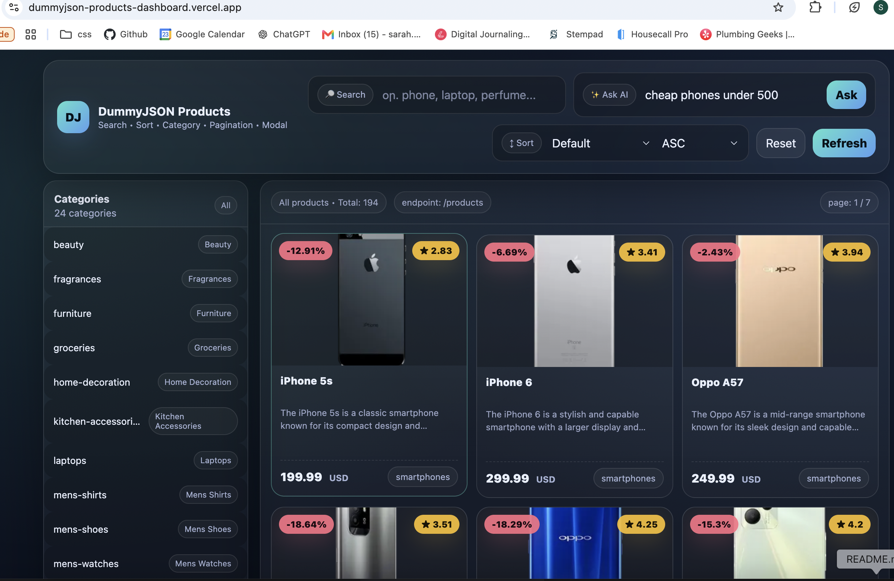

# DummyJSON Products Dashboard

A product dashboard with a plain-English search: type *"cheap phones under 500"* and the grid
filters itself. Built with vanilla JavaScript, the DummyJSON API, and the Claude API.

**[▶ Live demo](https://dummyjson-products-dashboard.vercel.app)**



## What it does

Browse, search, sort and filter products, with a modal detail view — all from live DummyJSON data.

The ✨ **Ask AI** box takes a sentence instead of filters. *"a laptop for under 1000"*,
*"under 20 dollars"*, *"womens shoes"*. If you ask for something the shop doesn't sell, it says so.
If you say *"cheap"* without a number, it asks what your budget is rather than guessing.

## How the AI works

**The browser never sees my API key.** The page posts to a serverless function on Vercel; the key
lives in an environment variable on the server and never reaches the client.

**Claude reads. My code decides.** The model never picks products and never touches the data. It
turns a sentence into a small typed object:

```json
{ "category": "smartphones", "maxPrice": 500, "unavailable": false, "needsPrice": false }
```

**Every field is validated before it's used:**

- `category` is checked against the real list of DummyJSON categories — anything invented becomes
  `null`. The model once answered `"phones"`, which doesn't exist in the data.
- `maxPrice` must be an actual number, or it's `null`.
- Booleans are compared with `=== true`, so a string `"true"` doesn't slip through.
- The response is parsed inside `try/catch` — a malformed reply can't take the page down.

**The model is never allowed to invent a price.** It once returned `maxPrice: 50` for *"something
cheap for my kitchen"* — a number nobody supplied. Now the prompt forbids it and sets a
`needsPrice` flag instead, and the user is asked for their own figure. The model drafts, my code
decides, a human confirms.

Test cases and the reasoning behind each decision are in **[evals.md](./evals.md)**.

## Built with

Vanilla JavaScript · HTML · hand-written CSS · Vercel serverless functions (TypeScript) ·
Anthropic Claude API (Haiku 4.5) · DummyJSON API

## Known limits

- One category per query — *"cheap laptops and tablets"* can't be expressed.
- `"under 20"` returns `maxPrice: 20` and filters with `<=`, so a $20.00 item is included.
  Deliberate, and recorded in `evals.md`.
- Evals are run by hand; a script that checks all twelve automatically is the next step.
- The AI search needs the deployed site — a `file://` page can't call a relative `/api/` route.

## Run it locally

```bash
git clone git@github.com:Sarah-petrosyan/dummyjson-products-dashboard.git
npm install
```

Open `index.html` for the dashboard. The AI search requires a Vercel deployment with an
`ANTHROPIC_API_KEY` environment variable set.